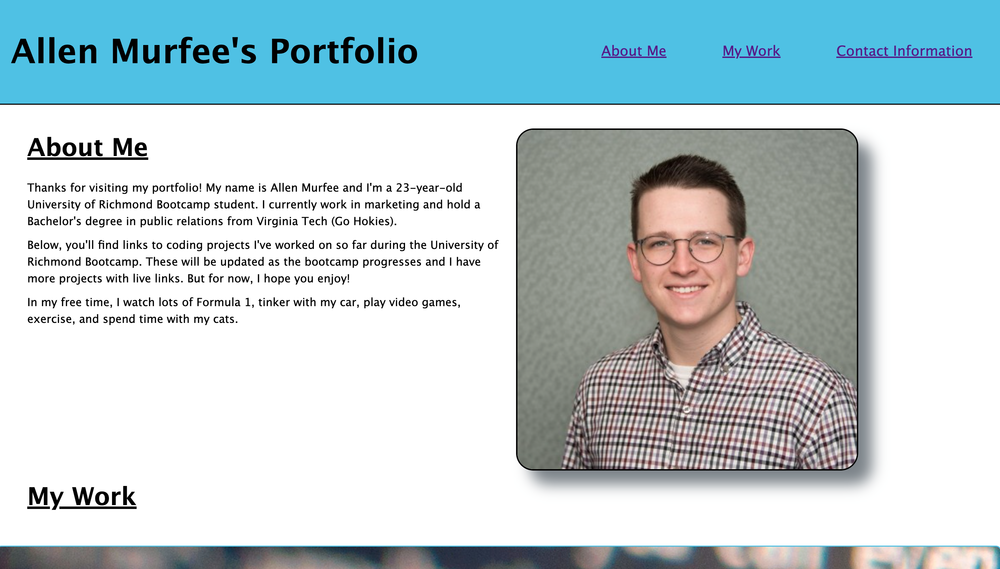

# Murfee Module 2 Challenge - Portfolio

## Description

This project is a portfolio website built from scratch using only HTML and CSS. The reason for building this project was to have a webpage where I could easily present information about myself and link to my CSS projects. While building this site, I answered a lot of questions I had regarding CSS, mainly pertaining to flexbox. I learned the quirks of flexbox, such as what needs to be applied to parent elements vs. child elements, how to use flex-grow and flex-shrink, how to incorporate flexbox with responsive layouts, and more. I also learned the importance of building a website that is friendly for all devices using a responsive layout.

## Installation

No installation is required, just click the following URL to visit the web page: https://allenmurfee.github.io/murfee-module-2-challenge/

You can view the code here: https://github.com/allenmurfee/murfee-module-2-challenge

## Usage

Click this URL to view the page: https://allenmurfee.github.io/murfee-module-2-challenge/

It should look like this screenshot:

## Credits

Used for Flexbox information:
https://www.w3schools.com/css/css3_flexbox.asp
https://www.geeksforgeeks.org/how-to-use-flex-to-shrink-an-image-in-css/
https://flexboxfroggy.com/
https://css-tricks.com/understanding-flex-grow-flex-shrink-and-flex-basis/

Information on rotating:
https://developer.mozilla.org/en-US/docs/Web/CSS/transform-function/rotate

## License

MIT License

## Features

1. Animations when hovering over profile picture.
2. Responsive layout regarding navigation and footer layout, "About Me" section paragraph spacing, and "My Work" section background repeating-image layout.
